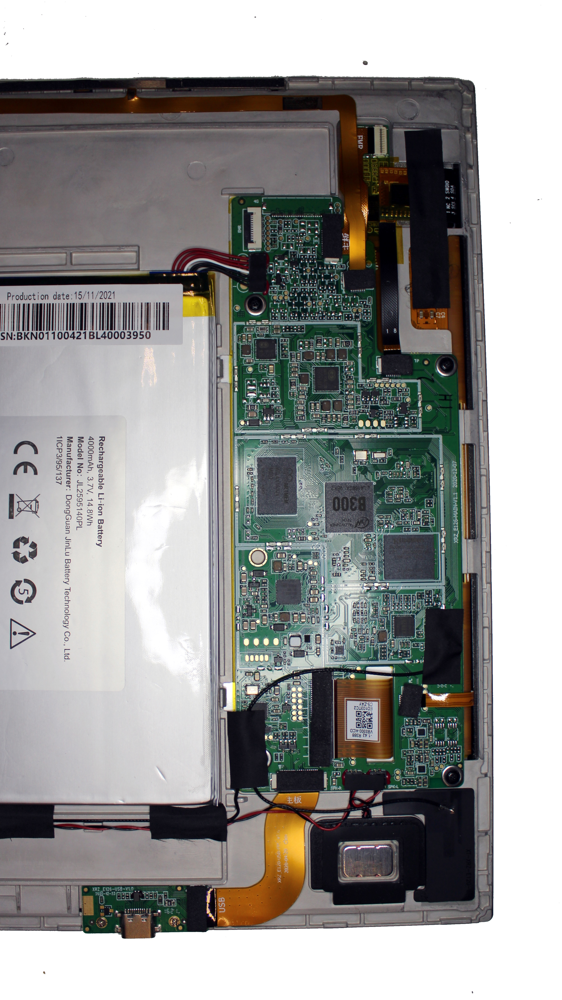
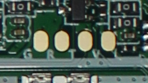

> [!NOTE]
> The story is not over

# The awesome history of Florian hacking his Bookeen Notéa (an e-ink tablet)

## Why the Bookeen Notéa?

The story begins when I saw on Twitter a video of the PieNote, a "hackable" e-ink tablet from Pine64.
This made me discover Pine64, and I even bought a PineTime (but I don't use it - it is working really fine thought, don't get me wrong, I just don't wear a watch very often).
I was hyped by the PineNote, an e-ink tablet on wich I could code or chat late at night without ruining my eyes.
This idea stuck in my head, I really wanted an e-ink tablet, but a PineNote was too expensive for me (delivery and taxes for France) and anyway they stopped selling it.

So I looked for alternatives.. well, not really, because I'm dumb.
Looking on the pinenote chat, I saw messages speaking of French :monocle_face: Hey! I'm French! :angry:
They talked about the Bookeen Notéa, an e-ink tablet sold by Bookeen, a French company.
Same case so most likely same vendor...
There are a lot of tablets sharing this same case but the most important is the SoC and it's rarely the same because Pine64 choose a RockShip RK3566 (questionnable bet, however why not?).
Some guess that the vendor leaks other clients schematics (or it is what I understood).
It already happened: the Lenovo Smart Paper shares the RK3566 SoC!

When I looked at the Bookeen Notéa product page, I read "CPU : 1.8 GHz Quad-Core" wait wait wait! I know a 1.8 GHz Quad-Core SoC!
And I thought very hard: "It must be the same RK3566 SoC".
Now the stuck idea were not "Buy a PineNote" anymore but "Buy a Bookeen Notéa and hack it like a PineNote", even if I didn't knew if it was possible.
I still asked on the PineNote chat.. but no one knows what SoC does the Bookeen Notéa use.
Well, I will be the first to discover I guess, I need to buy one.
Second-hand on "Leboncoin", because 400 euros for an almost three years old tablet is too much.
I frequently looked for new offer and tell me why someday the offers just started to disappear in one day :thinking:
Ok, ok, I need one, 280 euros (it's too much :cry:) and I will stop thinking of it.

In the end, the SoC is an **Alwinner B300**! :tada:
Oh shit... that's sad.

Okay, okay, okay. Do. Not. Panick.
You wanted an e-ink tablet, right? And this is an e-ink tablet! So you can use it.
I wanted to code and chat, so I can plug a keyboard and type - Oh. My. God. That's SLOW.
How can it be that slow? Using the pen is not that slow, why is the keyboard that slow?

I need to hack it, there's no other solutions.

## What can I do?

Ok, so let's dive in.

How do I know that's a B300?

When I plug the tablet to my computer and run `lsusb` I can read this:
```
Bus 001 Device 005: ID 1f3a:1006 Allwinner Technology BOOKEEN
```

I can access the AOSP Parameters app with the *Activity Manager* app (`com.activitymanager` found on *F-Droid*), in system infos I can read:
```
Android version
8.1.0

Processor type
QuadCore-B300

Firmware version
B300-o-mr1-v1.0rc2

Kernel version
4.9.5 (gcc version 5.3.1 20160412 (Linaro GCC 5.3-2016.05))
chichengzao@ubuntu #10
Thu Jun 15 10:53:49 CST 2023

Build number
OPM1.171019.026.20230928-094810 test-keys
```

Note that searching "chichengzao" on Google only respond with this repo about the PineNote: https://github.com/DorianRudolph/pinenotes :upside_down: 

But of course, opening-it permitted to see the chips.

## Qui ne tente rien n'a rien

I kindly asked Bookeen if they could help me hacking there tablet.

First try, they just didn't respond to me. So I've send another request without telling the subject, just : "You didn't respond to me !".
The next day an assistant answered (something like) : "Oh, sorry, could you reiterate your question" and so I did.
Some days after, look at this beautiful and expected message (in french of course, too lazy to translate) :

> J'ai transmis votre demande au service technique et développeurs, et malheureusement, ils ne transmettent aucune ressources interne ou système d'exploitation liés à nos produits, ici donc la Notéa.
> Nous vous prions de nous excuser pour la gêne occasionné et de ne pouvoir vous assister d'avantage.

## Connect to ADB

First, install adb, connect the Notéa to your computer.

Now, to connect to ADB, go to the developpers options.

That means, iirc, install an app to open the AOSP Parameters then go to `system settings > about` tap multiple times the `build version` and you're now developper.

In the developper settings, first change `USB mode` to `PTP` and then enable the `USB debugging`, it will ask you to trus your connected computer.

I remember tweaking the `51-android.rules` but it seems like I ended up not changing it.

Type `adb devices` to see if it's correctly connected.

## Launch Fastboot

With adb you can now use `adb reboot bootloader`, it will freeze, and reboot to the bootloader so you will only see the *Notéa* logo.

`fastboot devices` will say
```
Android Fastboot         Android Fastboot
```

## Install a TWRP ?

It means you're connected ! So maybe you can flash en TWRP ? Well I think, but I'm really too fearful to try, as I mentionned on this nooby issue https://github.com/iscilyas/tolino_b300_twrp/issues/4

I don't know if a TWRP will help me for anything... I would want to backup the partitions first.

Here's some interesting links I found about Allwinner B300 running tablets :

- https://github.com/Morxi/twrp_devices_allwinner_b300
- https://github.com/Ryogo-X/nook_gentoo_twrp
- https://github.com/iscilyas/tolino_b300_twrp
- https://github.com/qwerty12/inkPalm-5-EPD105-root

## Crack-open it

To open it, first of all, shutdown the tablet (seems legit). Next, just use some guitar picks to open the case on the side of the screen (without destroying the screen of course).

Here is me opening the Bookeen Notéa.

https://github.com/user-attachments/assets/3c401e47-f019-4d12-93be-462948686443

## Inside it, the PCB

Here is a picture of the inside.


I swear these fingerprints on the metal casing are not mines. It was like this before I open it.
_Blame the Chinese workers_.

The plastic power button has a little transparency hole, to let passing light, but there's no LED soldered beneath it.



Well, it looks like the PineNote, it is very similar.
I can even tell you that it is the same screen and the same screen driver.
But it's sadly not the same touchscreen.

There are connectors for connecting an "EMR" with a flat flexible cable that's unused. And another one that is used.
Looking at the Pinenote PCB, it is the other way around.

## FEL mode via UART ?

I had no clue on how to access [the FEL mode](https://linux-sunxi.org/FEL) on my tablet... There's no SD Card, no volume buttons... So the only hope is UART ?

And if I look around, I could see a lot of four soldering pads... So I searched on the Internet to know if there are technics to find UART pads.
And yes : sometimes the pads are labelled `G`, `R`, `T` and `V` for GND, RX, TX and VCC.

HERE THERE ARE ! :open_mouth:



Next step for me is to solder some jumper wires on it and try to access the FEL mode.
(Even if I succeed, I don't know the next step)
