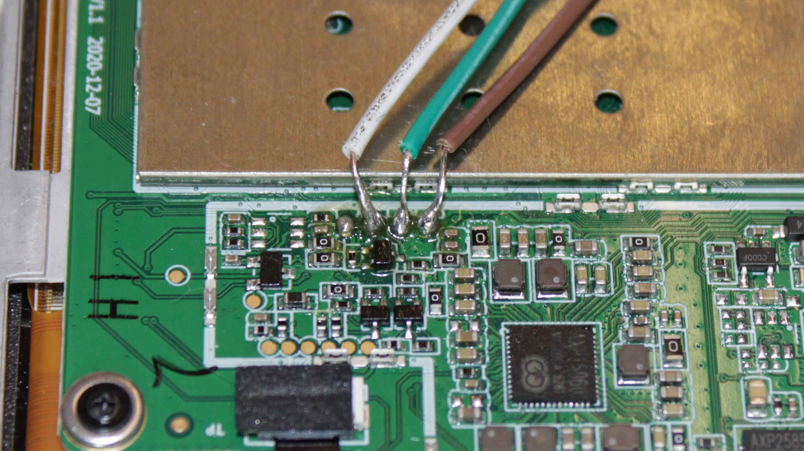
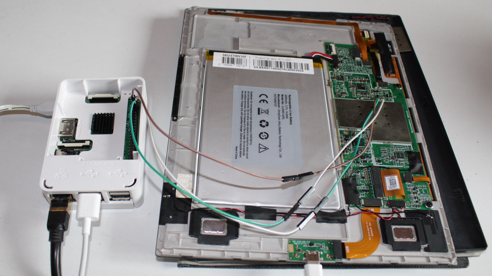

> [!NOTE]
> The story is not over

# The awesome history of Florian hacking his Bookeen Notéa (an e-ink tablet)

## Why the Bookeen Notéa?

The story begins when I saw on Twitter a video of the PieNote, a "hackable" e-ink tablet from Pine64.
This made me discover Pine64, and I even bought a PineTime (but I don't use it - it is working really fine thought, don't get me wrong, I just don't wear a watch very often).
I was hyped by the PineNote, an e-ink tablet on wich I could code or chat late at night without ruining my eyes.
This idea stuck in my head, I really wanted an e-ink tablet, but a PineNote was too expensive for me (delivery and taxes for France) and anyway they stopped selling it.

So I looked for alternatives.. well, not really, because I'm dumb.
Looking on the pinenote chat, I saw messages speaking of French :monocle_face: Hey! I'm French! :angry:
They talked about the Bookeen Notéa, an e-ink tablet sold by Bookeen, a French company.
Same case so most likely same vendor...
There are a lot of tablets sharing this same case but the most important is the SoC and it's rarely the same because Pine64 choose a RockShip RK3566 (questionnable bet, however why not?).
Some guess that the vendor leaks other clients schematics (or it is what I understood).
It already happened: the Lenovo Smart Paper shares the RK3566 SoC!

When I looked at the Bookeen Notéa product page, I read "CPU : 1.8 GHz Quad-Core" wait wait wait! I know a 1.8 GHz Quad-Core SoC!
And I thought very hard: "It must be the same RK3566 SoC".
Now the stuck idea were not "Buy a PineNote" anymore but "Buy a Bookeen Notéa and hack it like a PineNote", even if I didn't knew if it was possible.
I still asked on the PineNote chat.. but no one knows what SoC does the Bookeen Notéa use.
Well, I will be the first to discover I guess, I need to buy one.
Second-hand on "Leboncoin", because 400 euros for an almost three years old tablet is too much.
I frequently looked for new offer and tell me why someday the offers just started to disappear in one day :thinking:
Ok, ok, I need one, 280 euros (it's too much :cry:) and I will stop thinking of it.

In the end, the SoC is an **Alwinner B300**! :tada:
Oh shit... that's sad.

Okay, okay, okay. Do. Not. Panick.
You wanted an e-ink tablet, right? And this is an e-ink tablet! So you can use it.
I wanted to code and chat, so I can plug a keyboard and type - Oh. My. God. That's SLOW.
How can it be that slow? Using the pen is not that slow, why is the keyboard that slow?

I need to hack it, there's no other solutions.

## What can I do?

Ok, so let's dive in.

How do I know that's a B300?

When I plug the tablet to my computer and run `lsusb` I can read this:
```
Bus 001 Device 005: ID 1f3a:1006 Allwinner Technology BOOKEEN
```

I can access the AOSP Parameters app with the *Activity Manager* app (`com.activitymanager` found on *F-Droid*), in system infos I can read:
```
Android version
8.1.0

Processor type
QuadCore-B300

Firmware version
B300-o-mr1-v1.0rc2

Kernel version
4.9.5 (gcc version 5.3.1 20160412 (Linaro GCC 5.3-2016.05))
chichengzao@ubuntu #10
Thu Jun 15 10:53:49 CST 2023

Build number
OPM1.171019.026.20230928-094810 test-keys
```

Note that searching "chichengzao" on Google only respond with this repo about the PineNote: https://github.com/DorianRudolph/pinenotes :upside_down: 

But of course, opening-it permitted to see the chips.

## Qui ne tente rien n'a rien

I kindly asked Bookeen if they could help me hacking there tablet.

First try, they just didn't respond to me. So I've send another request without telling the subject, just : "You didn't respond to me !".
The next day an assistant answered (something like) : "Oh, sorry, could you reiterate your question" and so I did.
Some days after, look at this beautiful and expected message (in french of course, too lazy to translate) :

> J'ai transmis votre demande au service technique et développeurs, et malheureusement, ils ne transmettent aucune ressources interne ou système d'exploitation liés à nos produits, ici donc la Notéa.
> Nous vous prions de nous excuser pour la gêne occasionné et de ne pouvoir vous assister d'avantage.

## Connect to ADB

First, install adb, connect the Notéa to your computer.

Now, to connect to ADB, go to the developpers options.

That means, iirc, install an app to open the AOSP Parameters then go to `system settings > about` tap multiple times the `build version` and you're now developper.

In the developper settings, first change `USB mode` to `PTP` and then enable the `USB debugging`, it will ask you to trus your connected computer.

I remember tweaking the `51-android.rules` but it seems like I ended up not changing it.

Type `adb devices` to see if it's correctly connected.

## Launch Fastboot

With adb you can now use `adb reboot bootloader`, it will freeze, and reboot to the bootloader so you will only see the *Notéa* logo.

`fastboot devices` will say
```
Android Fastboot         Android Fastboot
```

## Install a TWRP?

It means you're connected ! So maybe you can flash en TWRP? Well I think, but I'm really too fearful to try, as I mentionned on this nooby issue https://github.com/iscilyas/tolino_b300_twrp/issues/4

I don't know if a TWRP will help me for anything... I would want to backup the partitions first.

Here's some interesting links I found about Allwinner B300 running tablets :

- https://github.com/Morxi/twrp_devices_allwinner_b300
- https://github.com/Ryogo-X/nook_gentoo_twrp
- https://github.com/iscilyas/tolino_b300_twrp
- https://github.com/qwerty12/inkPalm-5-EPD105-root

## Crack-open it

To open it, first of all, shutdown the tablet (seems legit). Next, just use some guitar picks to open the case on the side of the screen (without destroying the screen of course).

Here is me opening the Bookeen Notéa.

https://github.com/user-attachments/assets/3c401e47-f019-4d12-93be-462948686443

## Inside it, the PCB

Here is a picture of the inside.


I swear these fingerprints on the metal casing are not mines. It was like this before I open it.
_Blame the Chinese workers_.

The plastic power button has a little transparency hole, to let passing light, but there's no LED soldered beneath it.


Well, it looks like the PineNote, it is very similar.
I can even tell you that it is the same screen and the same screen driver.
But it's sadly not the same touchscreen.

There are connectors for connecting an "EMR" with a flat flexible cable that's unused. And another one that is used.
Looking at the Pinenote PCB, it is the other way around.

## FEL mode via UART?

I had no clue on how to access [the FEL mode](https://linux-sunxi.org/FEL) on my tablet... There's no SD Card, no volume buttons... So the only hope is UART?

And if I look around, I could see a lot of four soldering pads... So I searched on the Internet to know if there are technics to find UART pads.
And yes : sometimes the pads are labelled `G`, `R`, `T` and `V` for GND, RX, TX and VCC.

HERE THERE ARE ! :open_mouth:


So I soldered jumper wires on it.



I'm so proud of this soldering as it didn't blew up everything.

Now I need an UART adapter, and I don't have one. I have some Arduinos but there are in 5V UART and the Allwinner hardware are commonly in 3.3V. However I have a beautiful little computer that has a UART 3.3V connector: a Raspberry Pi 3B :smiley:.

Look at this neat setup.



## FEL, FEL triggered mode, who's the fairest SoC of them all?

Now I can boot the Notéa and look on the UART output...

Ooooooooooh Yes! That's my boy! Look at this fantastic logging lines I see right spitting from the Soc!

<details>
    <summary>----- See the Bookeen Notéa booting logs -----</summary>

    [115]HELLO! BOOT0 is starting!
    [118]boot0 commit : 000a620ce443178c1a35bdeb5deeb23d3180f34f

    [135]rsb_send_initseq: rsb clk 400Khz -> 3Mhz
    [140]PMU: AXP858
    [141][pmu]: name dcdc4, min_vol 500mv, max_vol 1540, cfg_reg 0x00000016, cfg_mask 0x0000007f            step0_val 10, split1_val 1220, step1_val 20, ctrl_reg_addr 0x00000015, ctrl_bit_ofs 4
    [159][pmu]: name dcdc2, min_vol 500mv, max_vol 1540, cfg_reg 0x00000014, cfg_mask 0x0000007f            step0_val 10, split1_val 1220, step1_val 20, ctrl_reg_addr 0x00000010, ctrl_bit_ofs 1
    [177]set pll start
    [187]rtc[0] value = 0x00000000
    [190]rtc[1] value = 0x00000000
    [193]rtc[2] value = 0x00000000
    [196]rtc[3] value = 0x0000a102
    [199]rtc[4] value = 0x00000000
    [202]rtc[5] value = 0x00000000
    [205]key pressed value=0x00000016
    [209]key pressed value=0x00000016
    [252]time out
    [253]DRAM BOOT DRIVE INFO: V1.14
    [256]chip id check OK
    [259][pmu]: name dcdc5, min_vol 800mv, max_vol 1840, cfg_reg 0x00000017, cfg_mask 0x0000007f            step0_val 10, split1_val 1120, step1_val 20, ctrl_reg_addr 0x00000010, ctrl_bit_ofs 4
    [276]DRAM_VCC set to 1100 mv
    [279]DRAM CLK =720 MHZ
    [281]DRAM Type =8 (3:DDR3,4:DDR4,7:LPDDR3,8:LPDDR4)
    [320]Training result is = 00000007
    [325]Actual DRAM SIZE =2048 M
    [328]DRAM SIZE =2048 M,para1 = 0000310a,para2 = 08000000
    [341]DRAM simple test OK.
    [344]dram size =2048
    [348]card no is 2
    [350]sdcard 2 line count 8
    [352][mmc]: mmc driver ver 2018-04-08 14:50
    [356][mmc]: mmc 2 bias 00000004
    [365][mmc]: ***Try MMC card 2***
    [381][mmc]: MMC 5.1
    [383][mmc]: HSDDR52/DDR50 8 bit
    [386][mmc]: 50000000 Hz
    [388][mmc]: 29856 MB
    [390][mmc]: ***SD/MMC 2 init OK!!!***
    [490]Loading boot-pkg Succeed(index=0).
    [494]Entry_name        = scp
    [504]Entry_name        = optee
    [510]Entry_name        = u-boot
    [526]Entry_name        = soc-cfg
    [530]Entry_name        = dtb
    [534]Entry_name        = logo
    [537]Entry_name        = shutdowncharge
    [541]Entry_name        = androidcharge
    [545]Ready to disable icache.
    [548]0xffffffff 0xffffffff
    [551]0xff1affff 0xffffffff
    [553]0xff0f17ff 0xffffffff
    [556]0x1616ffff 0xffff2414
    [559]0x141dffff 0xffffffff
    [561]0x1717ffff 0xffffffff
    [564]Jump to secend Boot.
    MESSAGE: [0x0] TEE-CORE: arisc version: []


    U-Boot 2014.07 (May 25 2023 - 20:27:00) Allwinner Technology

    uboot commit : 0c4b5570dc773d5d2b76265612b726d7d2b3f8a3

    secure enable bit: 0
    normal mode: with secure monitor
    [0.595]pmbus:   ready
    [0.595]PMU: AXP858
    [0.595]PMU: AXP858 found
    [0.595]pmu_type = 49
    [0.596]BMU: AW1867
    [0.598]pmu_on_ctl:9
    [0.601]Charge current:1050 ma
    [0.602]Input current:1050 ma
    set pc_bias(1) bias:1800
    [0.608]PMU: cpux 1008 Mhz,AXI=504 Mhz
    [0.611]PLL6=600 Mhz,AHB1=200 Mhz, APB1=100Mhz MBus=400Mhz
    DRAM:  2 GiB
    Relocation Offset is: 75ddf000
    [0.655]initr_malloc
    gic: sec monitor mode
    [0.739]initr_multi_core
    PowerBus = 2( 2:vBus 3:acBus other: not exist), bat_vol=4012, safe_vol=3600
    boot up: bat_vol=4012, safe_vol=3600, charger=2
    [0.739]power on cpu1
    [cpu1]PowerBus = 2( 2:vBus 3:acBus other: not exist)
    [cpu1]Battery Voltage=4012, safe_vol=3600, Ratio=83
    [0.743]poweron cause 0
    [cpu1]STATE_NORMAL_BOOT
    [cpu1]drv_disp_init
    [0.749]power on cpu2
    workmode = 0,storage type = 2
    [cpu1]init_clocks: finish init_clocks.
    [0.753]MMC:      2
    SUNXI SD/MMC: 2
    [cpu1]EINK: lcd_x=276, lcd_y=1421, dclk=35
    [cpu1]pwm_request:pwm number = 1
    [cpu1]request pwm success, spwm0:pwm16:0x7020c00.
    [0.771]bits=5,data_len=16,width=1872,height=1404
    [0.775]lsl=11,lbl=8,ldl=234,lel=23
    [0.778]fsl=1,fbl=4,fdl=1404,fel=12
    [0.781]gdck_sta=10,lgonl=215
    Normal
    [0.786]Item0 (Map) magic is bad
    [0.787]the secure storage item0 copy0 is bad
    [0.792]Item0 (Map) magic is bad
    [0.794]the secure storage map is empty
    [0.798]no item name key_burned_flag in the map
    [0.802]sunxi storage read fail
    [0.805]sunxi secure storage has no flag
    [0.808]usb burn from boot
    delay time 0
    [cpu1]reading vcom.bin
    [0.815]usb prepare ok
    [cpu1]5 bytes read in 4 ms ([cpu1]1000 Bytes/s)
    [cpu1]drv_disp_init finish
    [0.824][cpu1]fetch script data boot_disp.output_full fail
    [0.828][cpu1]
    BMP file is to large,scn_w=276,scn_h=1421,bmp_w=380,bmp_h=328
    [1.117]overtime
    [1.117]do_burn_from_boot usb : no usb exist
    [1.122]no item name device_unlock in the map
    [1.122]sunxi storage read fail
    [1.122]no item name fastboot_status_flag in the map
    [1.122]sunxi storage read fail
    sunxi secure storage has no flag
    --------fastboot partitions--------
    -total partitions:16-
    -name-        -start-       -size-
    UDISK       : c1000000      87bfbc00
    bootloader  : 1000000       2000000
    env         : 3000000       1000000
    boot        : 4000000       2000000
    system      : 6000000       60000000
    vendor      : 66000000      f000000
    misc        : 75000000      1000000
    recovery    : 76000000      2000000
    cache       : 78000000      40000000
    metadata    : b8000000      1000000
    private     : b9000000      1000000
    frp         : ba000000      80000
    empty       : ba080000      f80000
    dto         : bb000000      1000000
    media_data  : bc000000      1000000
    device      : bd000000      4000000
    -----------------------------------
    time out
    key not det ota mode
    [4.238]Item0 (Map) magic is bad
    [4.238]the secure storage item0 copy0 is bad
    [4.239]Item0 (Map) magic is bad
    [4.239]the secure storage map is empty
    [4.239]no item name snum in the map
    [4.239]sunxi storage read fail
    reading sn.bin
    ** Unable to read file sn.bin **
    load file(sn.bin) error
    reading wavefile\bootlogo.bmp
    2629366 bytes read in 20 ms (125.4 MiB/s)
    bmp_buffer_change2Gray: sync cache
    waveform_path === default.bin
    reading default.bin
    8084496 bytes read in 51 ms (151.2 MiB/s)
    read waveform file from  default.bin   succeed
    [4.342]wavefile info: 320_R388_AF7311_ED103TC2C5_VB3300-KCD_TC.awf 2021.10.28.9:23:44:
    [4.342]eink_enable: init waveform ok
    [4.949]usb_net_init
    [4.949]run_main_loop
    Hit any key to stop autoboot:  0
    [5.063]Kernel load addr 0x40008000 size 15964 KiB
    [5.063]Kernel command line: selinux=1 androidboot.selinux=enforce buildvariant=user
    [5.063]RAM disk load addr 0x42000000 size 1158 KiB
    android.hardware = sun8iw15p1
    [5.105]
    Starting kernel ...

    [    0.000000] Booting Linux on physical CPU 0x0
    [    0.000000] Linux version 4.9.56 (chichengzao@ubuntu) (gcc version 5.3.1 20160412 (Linaro GCC 5.3-2016.05) ) #10 SMP PREEMPT Thu Jun 15 10:53:49 CST 2023
    [    0.000000] CPU: ARMv7 Processor [410fc075] revision 5 (ARMv7), cr=10c5387d
    [    0.000000] CPU: div instructions available: patching division code
    [    0.000000] CPU: PIPT / VIPT nonaliasing data cache, VIPT aliasing instruction cache
    [    0.000000] OF: fdt:Machine model: sun8iw15
    [    0.000000] bootconsole [earlycon0] enabled
</details>

There are tons of information in this, but I'm really not an expert.

I can read `Hit any key to stop autoboot:  0` but that append really too late, it's surely to stop the U-Boot.

What I want is launching the FEL mode. Reading the linux-sunxi wiki, sending the character `1` (`2` on some devices) would trigger the FEL mode. So I tried.

I was a bit struggling with spamming a character on the UART, most of the time it just wrote a bunch of the lettre I've pressed at the end and nothing more. Maybe we would need something spamming faster than my tiny fingers? So I draw this terrible command: `while [ true ]; do echo -n 1 > /dev/ttyS1; done`, do not forget to set the baudrate of the UART : `stty -F /dev/ttyS1 115200` and give it a try.

<details>
    <summary>----- See the Bookeen Notéa booting logs when spamming a character -----</summary>

    ERROR:   TEE-CORE: Panic at core/arch/arm/plat-sun8iw15p1/psci_sunxi.c:245 <psci_system_reset>
    ERROR:   TEE-CORE: Call stack:
    ERROR:   TEE-CORE:  0x486039a5
    ERROR:   TEE-CORE:  0x48608fbb
    ERROR:   TEE-CORE:  0x48608539
    ERROR:   TEE-CORE:  0x4861cc09
    ERROR:   TEE-CORE:  0x4860855f
    ERROR:   TEE-CORE:  0x486008d8
    �[98]HELLO! BOOT0 is starting!
    [101]boot0 commit : 000a620ce443178c1a35bdeb5deeb23d3180f34f

    [108]key press :

    [110]rsb_send_initseq: rsb clk 400Khz -> 3Mhz
    [114]PMU: AXP858
    [116][pmu]: name dcdc4, min_vol 500mv, max_vol 1540, cfg_reg 0x00000016, cfg_mask 0x0000007f            step0_val 10, split1_val 1220, step1_val 20, ctrl_reg_addr 0x00000015, ctrl_bit_ofs 4
    [134][pmu]: name dcdc2, min_vol 500mv, max_vol 1540, cfg_reg 0x00000014, cfg_mask 0x0000007f            step0_val 10, split1_val 1220, step1_val 20, ctrl_reg_addr 0x00000010, ctrl_bit_ofs 1
    [152]set pll start
    [162]rtc[0] value = 0x00000000
    [165]rtc[1] value = 0x00000000
    [168]rtc[2] value = 0x00000000
    [171]rtc[3] value = 0x0000a102
    [174]rtc[4] value = 0x00000000
    [177]rtc[5] value = 0x00000000
    [180]key pressed value=0x00000016
    [183]key pressed value=0x00000016
    [226]time out
    [228]DRAM BOOT DRIVE INFO: V1.14
    [231]chip id check OK
    [233][pmu]: name dcdc5, min_vol 800mv, max_vol 1840, cfg_reg 0x00000017, cfg_mask 0x0000007f            step0_val 10, split1_val 1120, step1_val 20, ctrl_reg_addr 0x00000010, ctrl_bit_ofs 4
    [251]DRAM_VCC set to 1100 mv
    [253]DRAM CLK =720 MHZ
    [256]DRAM Type =8 (3:DDR3,4:DDR4,7:LPDDR3,8:LPDDR4)
    [295]Training result is = 00000007
    [300]Actual DRAM SIZE =2048 M
    [302]DRAM SIZE =2048 M,para1 = 0000310a,para2 = 08000000
    [316]DRAM simple test OK.
    [319]dram size =2048
    [323]card no is 2
    [324]sdcard 2 line count 8
    [327][mmc]: mmc driver ver 2018-04-08 14:50
    [331][mmc]: mmc 2 bias 00000004
    [340][mmc]: ***Try MMC card 2***
    [355][mmc]: MMC 5.1
    [357][mmc]: HSDDR52/DDR50 8 bit
    [360][mmc]: 50000000 Hz
    [363][mmc]: 29856 MB
    [365][mmc]: ***SD/MMC 2 init OK!!!***
    [465]Loading boot-pkg Succeed(index=0).
    [469]Entry_name        = scp
    [479]Entry_name        = optee
    [485]Entry_name        = u-boot
    [501]Entry_name        = soc-cfg
    [505]Entry_name        = dtb
    [509]Entry_name        = logo
    [512]Entry_name        = shutdowncharge
    [516]Entry_name        = androidcharge
    [520]Ready to disable icache.
    [523]0xffffffff 0xffffffff
    [525]0xff1affff 0xffffffff
    [528]0xff0f17ff 0xffffffff
    [531]0x1616ffff 0xffff2414
    [533]0x141dffff 0xffffffff
    [536]0x1717ffff 0xffffffff
    [539]Jump to secend Boot.
    MESSAGE: [0x0] TEE-CORE: arisc version: []


    U-Boot 2014.07 (May 25 2023 - 20:27:00) Allwinner Technology

    uboot commit : 0c4b5570dc773d5d2b76265612b726d7d2b3f8a3

    secure enable bit: 0
    normal mode: with secure monitor
    [0.570]pmbus:   ready
    [0.570]PMU: AXP858
    [0.570]PMU: AXP858 found
    [0.570]pmu_type = 49
    [0.571]BMU: AW1867
    [0.573]pmu_on_ctl:9
    [0.575]Charge current:1050 ma
    [0.577]Input current:1050 ma
    set pc_bias(1) bias:1800
    [0.582]PMU: cpux 1008 Mhz,AXI=504 Mhz
    [0.585]PLL6=600 Mhz,AHB1=200 Mhz, APB1=100Mhz MBus=400Mhz
    DRAM:  2 GiB
    Relocation Offset is: 75ddf000
    [0.630]initr_malloc
    gic: sec monitor mode
    [0.713]initr_multi_core
    PowerBus = 2( 2:vBus 3:acBus other: not exist), bat_vol=4180, safe_vol=3600
    boot up: bat_vol=4180, safe_vol=3600, charger=2
    [0.713]power on cpu1
    [cpu1]PowerBus = 2( 2:vBus 3:acBus other: not exist)
    [cpu1]Battery Voltage=4180, safe_vol=3600, Ratio=100
    [0.717]poweron cause 0
    [cpu1]STATE_NORMAL_BOOT
    [cpu1]drv_disp_init
    [0.724]power on cpu2
    workmode = 0,storage type = 2
    [cpu1]init_clocks: finish init_clocks.
    [0.728]MMC:      2
    SUNXI SD/MMC: 2
    [cpu1]EINK: lcd_x=276, lcd_y=1421, dclk=35
    [cpu1]pwm_request:pwm number = 1
    [cpu1]request pwm success, spwm0:pwm16:0x7020c00.
    [0.746]bits=5,data_len=16,width=1872,height=1404
    [0.750]lsl=11,lbl=8,ldl=234,lel=23
    [0.753]fsl=1,fbl=4,fdl=1404,fel=12
    [0.756]gdck_sta=10,lgonl=215
    Normal
    [0.761]Item0 (Map) magic is bad
    [0.762]the secure storage item0 copy0 is bad
    [0.767]Item0 (Map) magic is bad
    [0.769]the secure storage map is empty
    [0.773]no item name key_burned_flag in the map
    [0.777]sunxi storage read fail
    [0.780]sunxi secure storage has no flag
    [0.783]usb burn from boot
    delay time 0
    [cpu1]reading vcom.bin
    [0.790]usb prepare ok
    [cpu1]5 bytes read in 4 ms ([cpu1]1000 Bytes/s)
    [cpu1]drv_disp_init finish
    [0.798][cpu1]fetch script data boot_disp.output_full fail
    [0.802][cpu1]
    BMP file is to large,scn_w=276,scn_h=1421,bmp_w=380,bmp_h=328
    usb sof ok
    [1.004]usb probe ok
    [1.004]usb setup ok
    set address 0x13
    set address 0x13 ok
    [4.005]do_burn_from_boot usb : have no handshake
    [4.010]no item name device_unlock in the map
    [4.010]sunxi storage read fail
    [4.010]no item name fastboot_status_flag in the map
    [4.010]sunxi storage read fail
    sunxi secure storage has no flag
    --------fastboot partitions--------
    -total partitions:16-
    -name-        -start-       -size-
    UDISK       : c1000000      87bfbc00
    bootloader  : 1000000       2000000
    env         : 3000000       1000000
    boot        : 4000000       2000000
    system      : 6000000       60000000
    vendor      : 66000000      f000000
    misc        : 75000000      1000000
    recovery    : 76000000      2000000
    cache       : 78000000      40000000
    metadata    : b8000000      1000000
    private     : b9000000      1000000
    frp         : ba000000      80000
    empty       : ba080000      f80000
    dto         : bb000000      1000000
    media_data  : bc000000      1000000
    device      : bd000000      4000000
    -----------------------------------
    time out
    key not det ota mode
    [7.126]Item0 (Map) magic is bad
    [7.126]the secure storage item0 copy0 is bad
    [7.127]Item0 (Map) magic is bad
    [7.127]the secure storage map is empty
    [7.127]no item name snum in the map
    [7.127]sunxi storage read fail
    reading sn.bin
    ** Unable to read file sn.bin **
    load file(sn.bin) error
    reading wavefile\bootlogo.bmp
    2629366 bytes read in 20 ms (125.4 MiB/s)
    bmp_buffer_change2Gray: sync cache
    waveform_path === default.bin
    reading default.bin
    8084496 bytes read in 51 ms (151.2 MiB/s)
    read waveform file from  default.bin   succeed
    [7.228]wavefile info: 320_R388_AF7311_ED103TC2C5_VB3300-KCD_TC.awf 2021.10.28.9:23:44:
    [7.229]eink_enable: init waveform ok
    [7.836]usb_net_init
    [7.836]run_main_loop
    Hit any key to stop autoboot:  0
    [7.950]Kernel load addr 0x40008000 size 15964 KiB
    [7.950]Kernel command line: selinux=1 androidboot.selinux=enforce buildvariant=user
    [7.950]RAM disk load addr 0x42000000 size 1158 KiB
    android.hardware = sun8iw15p1
    [7.991]
    Starting kernel ...

    [    0.000000] Booting Linux on physical CPU 0x0
    [    0.000000] Linux version 4.9.56 (chichengzao@ubuntu) (gcc version 5.3.1 20160412 (Linaro GCC 5.3-2016.05) ) #10 SMP PREEMPT Thu Jun 15 10:53:49 CST 2023
    [    0.000000] CPU: ARMv7 Processor [410fc075] revision 5 (ARMv7), cr=10c5387d
    [    0.000000] CPU: div instructions available: patching division code
    [    0.000000] CPU: PIPT / VIPT nonaliasing data cache, VIPT aliasing instruction cache
    [    0.000000] OF: fdt:Machine model: sun8iw15
    [    0.000000] bootconsole [earlycon0] enabled
    ^TR^TR^TR^TR^TR^TR^TR^TR^TR^TR^TR^TR^TR^TR^TR^TR^TR^TR^TR^TR^TR^TR^TR^TR^TR^TR^TR^TR^TR^TR^TR^TR^TR^TR^TR^TR^TR^TR^TR^TR^TR^TR^TR^TR^TR^TR^TR^TR^TR^TR^TR^TR^TR^TR^TR^TR^TR^TR^TR^TR^TR^TR^TR^TR^TR^TR^TR^TR^TR^TR^TR^TR^TR^TR^TR^TR^TR^TR^TR^TR^TR^TR^TR^TR^TR^TR^TR^TR^TR^TR^TR^TR^TR^TR^TR^TR^TR^TR^TR^TR^TR^TR^TR^TR^TR^TR^TR^TR^TR^TR^TR^TR^TR^TR^TR^TR^TR^TR^TR^TR^TR^TR^TR^TR^TR^TR^TR^TR^TR^TRR^TR^TR^TR^TR^TR^TR^TR^TR^TR
</details>

The first lines you see (the `ERROR: TEE-CORE`...) appear when powering off the tablet.

Now there is not a bunch of `1` written at the end, but `^TR`. I don't even know what that means, but it's not `1`. I was confused about that, I thought my command wasn't working fine (that's in fact maybe the case).
And then I read this line that wasn't showing up before: `[108]key press :`.

Looking back to my multiple tries, I could read `[122]key press : �` too with a bunch of `�` at the end. And even `[132]key press : 1`, with a bunch of `�` at the end.
So the Notéa surely read a character, but `1` does not seems to do anything... let's try with `2`: `[133]key press : �` again with a bunch of `&`, retry a few more time.

Eventually it read a `2`! Look at that

```
[100]HELLO! BOOT0 is starting!
[103]boot0 commit : 000a620ce443178c1a35bdeb5deeb23d3180f34f

[109]key press : 2
[111]rsb_send_initseq: rsb clk 400Khz -> 3Mhz
[116]PMU: AXP858
[117][pmu]: name dcdc4, min_vol 500mv, max_vol 1540, cfg_reg 0x00000016, cfg_mask 0x0000007f            step0_val 10, split1_val 1220, step1_val 20, ctrl_reg_addr 0x00000015, ctrl_bit_ofs 4
[135][pmu]: name dcdc2, min_vol 500mv, max_vol 1540, cfg_reg 0x00000014, cfg_mask 0x0000007f            step0_val 10, split1_val 1220, step1_val 20, ctrl_reg_addr 0x00000010, ctrl_bit_ofs 1
[153]set pll start
[163]rtc[0] value = 0x00000000
[166]rtc[1] value = 0x00000000
[169]rtc[2] value = 0x00000000
[172]rtc[3] value = 0x0000a102
[175]rtc[4] value = 0x00000000
[178]rtc[5] value = 0x00000000
[181]detected user input 2
[184]reset pll
```

`reset pll` I don't even know what that means but it's frozen! Just plug the USB and see the `lsusb`:

```
Bus 001 Device 049: ID 1f3a:efe8 Allwinner Technology sunxi SoC OTG connector in FEL/flashing mode
```

Ooooooooooh YEAH BABY! We did it! The world exclusive Bookeen Notéa in FEL mode!!!

Let's now try `sunxi-fel`!

```
$ sunxi-fel version
Warning: no 'soc_sram_info' data for your SoC (id=****)
AWUSBFEX soc=0000****(unknown) 00000001 ver=0001 44 08 scratchpad=00007e00 00000000 00000000
```

> [!NOTE]
> I've redacted the SoC id. Don't ask, I'm just a jealous guy.

It's working!! I can do things like reading RAM:

```
$ sunxi-fel readl 0x004
Warning: no 'soc_sram_info' data for your SoC (id=****)
usb_bulk_send() ERROR -7: Operation timed out
```

## Boot0, then nothing

FEL mode is cool and everything but the only thing we can do with it is playing around with the memory and asking the SoC to execute something at a specific address...

We need more information about the tablet notably what hardware is used and where.
So according to this page, we could dump some of that from the memory https://linux-sunxi.org/Retrieving_device_information#Retrieving_data_over_USB_in_FEL_mode but there's a problem.
The reading fails because we enter FEL mode but boot1 has not been initialized, even if linux-sunxi wiki says that

> Boot1 is initialized using this method.

The thing is that I did not see boot1 anywhere, even when booting normaly, does boot1 even exists?

## From fastboot to efex?

I discovered another method of booting in FEL mode (or it looks like it is) by using `fastboot oem fex`, then rebooting enter the tablet in FEL mode without initializing boot1 neither.

## Kernel, U-Boot? It's GPL

I looked around in hope of finding the U-Boot and Kernel used, notably looking at the version used written in the logs.

The user on `adb shell` is named `virgo_perf1`.
The kernel is build by `chichengzao`.
The firmware version is `B300-o-mr1-v1.0rc2`.
All that information make me turn around in my research.

You know, Linux kernel and U-Boot are distributed under the GPL license wich is copyleft.
So the modified version should be distributed under the same conditions... So I asked Bookeen, who already provide kernel and u-boot for there other e-readers.
They kindly answered that they do not have access to the sources but that I could ask to the vendor : bigme.vip :no_mouth:

Okay, I knew that Bigme and Bookeen and even Pine64 hardware was manufactured by the same entity. But here, Bookeen's vendor is directly Bigme.
Looking for Bigme similar products, I could not find a tablet with the Bigme brand, with a B300 SoC and Android 8.1.
The closest I could find runs Android 11.

I've asked Bigme, let's wait for an anwser.

In the meantime, I'm starting to write wiki pages on the linux-sunxi wiki.

TO BE CONTINUED
